# Trump Tweet Analysis

A data analysis project examining tweet patterns, engagement metrics, and posting behavior from a dataset of 56,571
tweets.

## Table of Contents

- [Temporal Analysis of Tweet Clusters](#temporal-analysis-of-tweet-clusters)
- [Initial Overview of Dataset](#initial-overview-of-dataset)

## Temporal Analysis of Tweet Clusters

This section presents the visualizations generated from the cluster analysis of Trump's tweets.

### Labeling of Clusters
The clusters have manually been assigned lables/titels based on their keywords (top TF-IDF terms).

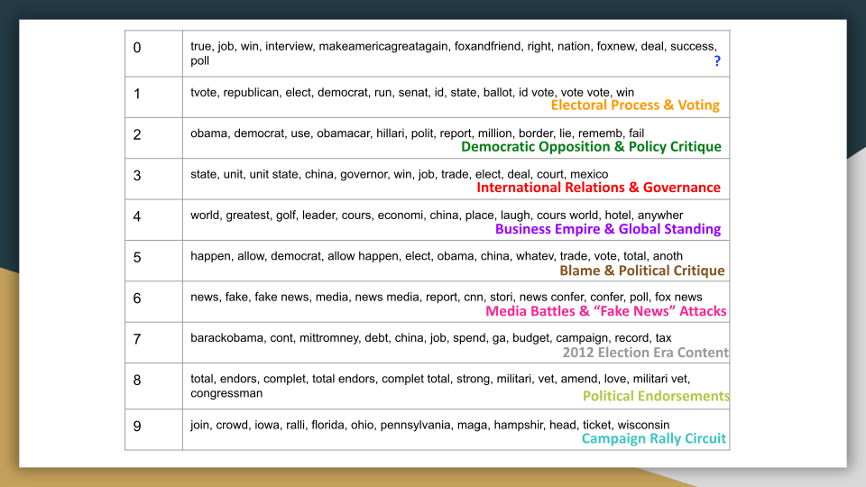

### Analysis
**Note on Interpretation**: The temporal patterns observed in these clusters show correlations between tweet topics and
time periods. However, correlation does not necessarily imply causation. For example, while we observe a spike in
Trump's tweets about Obama during Obama's presidential campaign, this spike may not be directly caused by the campaign
itself. Other factors such as media attention, political commentary trends, personal motivations, or unrelated events
occurring during the same period could contribute to or entirely explain these patterns. Readers should interpret these
temporal associations as descriptive observations rather than evidence of direct causal relationships.

### Cluster 9 - Campaign Rally Circuit

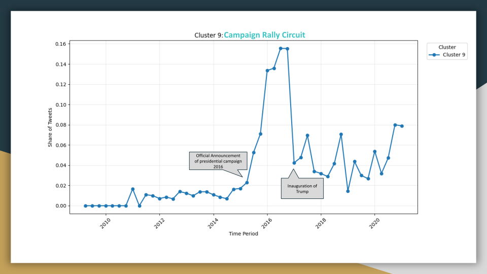

This visualization tracks the temporal evolution of **Cluster 9** (Campaign Rally Circuit) over time, measured
quarterly. This cluster captures Trump's tweets promoting campaign rallies and events across key battleground states.

#### Key Observations:

- The cluster shows prominent activity during campaign seasons, with notable spikes during the 2016 election cycle
- Strong presence of battleground state references (Iowa, Florida, Ohio, Pennsylvania, Wisconsin, New Hampshire)
- The temporal pattern reflects the intensity of his ground campaign efforts in swing states

#### Keywords (Top TF-IDF Terms):

`join, crowd, iowa, ralli, florida, ohio, pennsylvania, maga, hampshir, head, ticket, wisconsin`

These keywords reflect Trump's focus on mobilizing supporters through rallies in critical swing states, with references
to crowds, the MAGA slogan, and invitations for supporters to join events across the campaign trail.

---

### Cluster 7 - 2012 Election Era Content

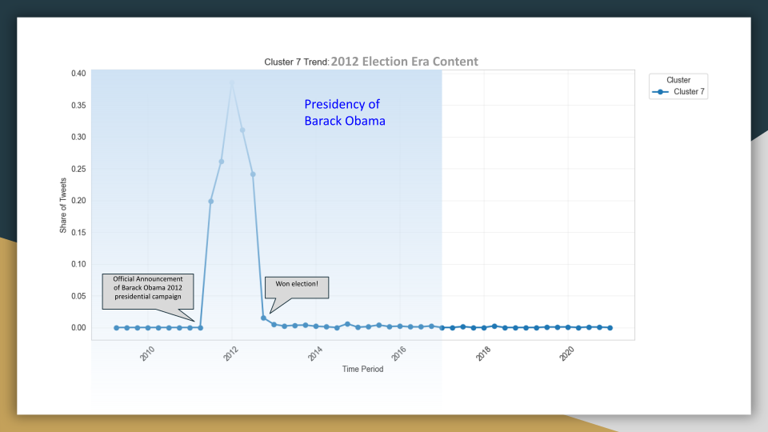

This visualization tracks the temporal evolution of **Cluster 7** (2012 Election Era Content) over time, measured
quarterly. This cluster captures Trump's tweets from the period surrounding Barack Obama's second presidential campaign
in 2012.

#### Key Observations:

- The cluster shows a dramatic spike during Barack Obama's re-election campaign, then drops sharply afterward
- This temporal pattern demonstrates how Trump engaged heavily with political commentary during Obama's campaign

#### Keywords (Top TF-IDF Terms):

`barackobama, cont, mittromney, debt, china, job, spend, ga, budget, campaign, record, tax`

These keywords clearly reflect the 2012 election discourse, mentioning both Obama and his Republican challenger Mitt
Romney, along with key campaign issues like debt, spending, and taxes.

---

### Cluster 6 - Media Battles & "Fake News" Attacks

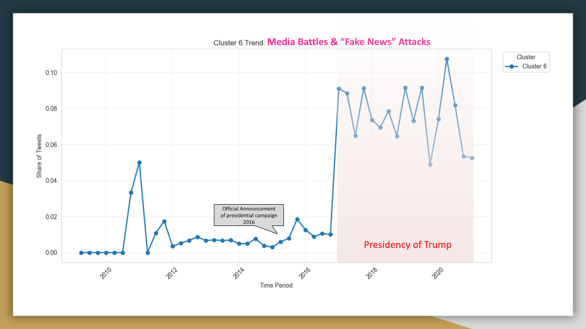

This visualization tracks the temporal evolution of **Cluster 6** (Media Battles & "Fake News" Attacks) over time,
measured quarterly. This cluster captures Trump's aggressive rhetoric targeting mainstream media outlets.

#### Key Observations:

- The cluster shows a dramatic spike that coincides with Trump becoming president in January 2017
- This temporal pattern demonstrates how Trump's anti-media rhetoric intensified significantly upon taking office
- The sustained elevated activity throughout his presidency reflects the ongoing contentious relationship with the press

#### Keywords (Top TF-IDF Terms):

`news, fake, fake news, media, news media, report, cnn, stori, news confer, confer, poll, fox news`

These keywords reflect Trump's consistent focus on media coverage and press interactions, including references to both
outlets he criticized (CNN) and supported (Fox News), news conferences, and his prominent use of the term "fake news" to
challenge unfavorable reporting.

---

### Cluster 3 - International Relations & Governance

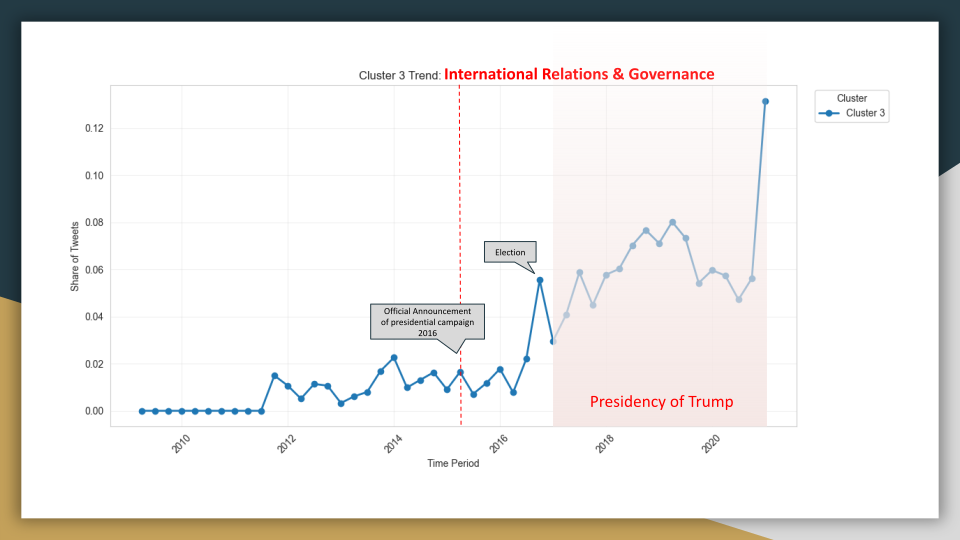

This visualization tracks the temporal evolution of **Cluster 3** (International Relations & Governance) over time,
measured quarterly. This cluster captures Trump's tweets about international trade, state-level politics, and governance
matters.

#### Key Observations:

- The cluster shows increased activity during his presidency

#### Keywords (Top TF-IDF Terms):

`state, unit, unit state, china, governor, win, job, trade, elect, deal, court, mexico`

These keywords reflect Trump's engagement with both domestic governance (state-level officials, courts) and
international relations (China, Mexico trade deals), often connecting economic concerns (jobs, trade) with political
victories and elections.

---

### Cluster 5 - Blame & Political Critique

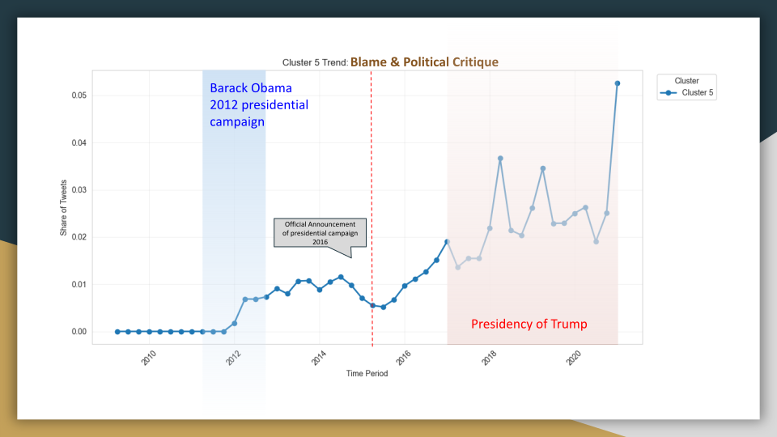

This visualization tracks the temporal evolution of **Cluster 5** (Blame & Political Critique) over time, measured
quarterly. This cluster captures Trump's tweets expressing frustration and assigning blame for various political and
economic outcomes.

#### Key Observations:

- The cluster emerges during Obama's presidential campaign and increases in activity during his own.

#### Keywords (Top TF-IDF Terms):

`happen, allow, democrat, allow happen, elect, obama, china, whatev, trade, vote, total, anoth`

These keywords reflect Trump's rhetoric of assigning blame, particularly targeting Democrats and Obama for allowing
various situations to occur ("allow happen").

---

## Initial Overview of Dataset

- **Total Tweets**: 56,571
- **Features**: text, isRetweet, isDeleted, device, favorites, retweets, date, isFlagged
- **No Missing Values**: Complete dataset with 0% missing data

### Engagement Metrics

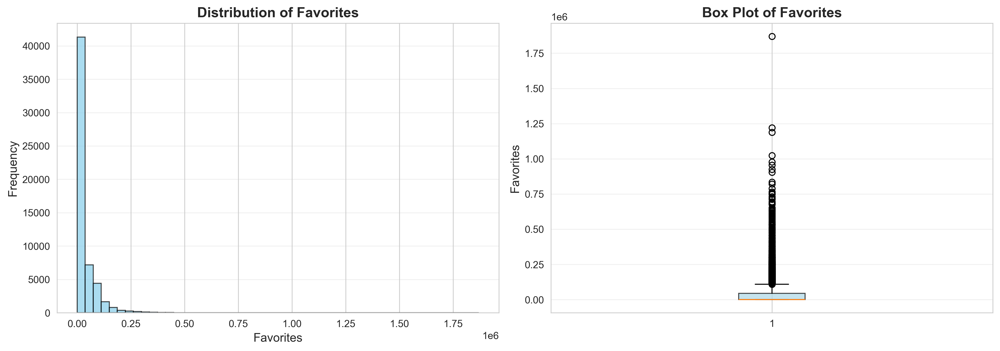

**Favorites**: The distribution is heavily right-skewed, with most tweets receiving low engagement (median: 164
favorites). However, some tweets achieved exceptional reach, with the maximum reaching 1.87 million favorites.

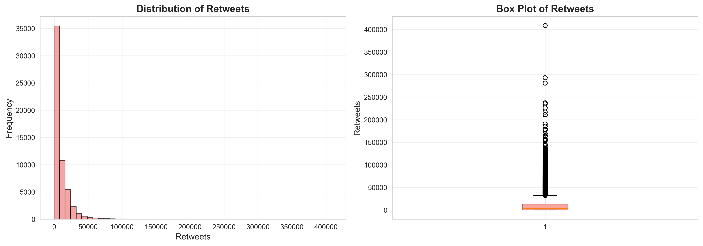

**Retweets**: Similar pattern to favorites, with a median of 3,450 retweets and a maximum of 408,866. The data shows
significant outliers indicating viral tweets.

### Tweet Characteristics

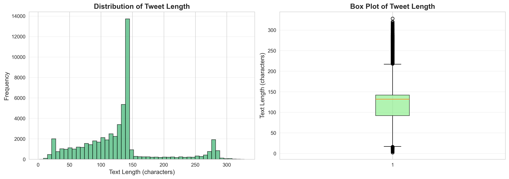

**Text Length**: Average tweet length is 128 characters, with most tweets concentrated around 132 characters (median).
This suggests concise messaging, well below Twitter's character limits.

### Content Type Analysis

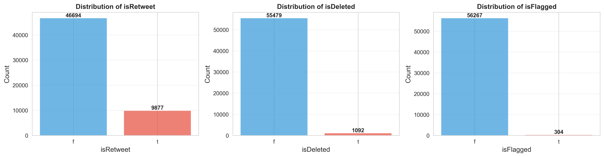

- **Retweets**: 9,877 retweets vs. 46,694 original tweets (17.5% retweet rate)
- **Deleted Tweets**: 1,092 deletions out of 56,571 (1.9% deletion rate)
- **Flagged Content**: Only 304 tweets flagged (0.5%)

### Device Usage

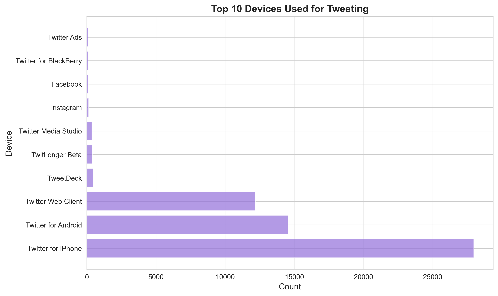

**Primary Devices**:

1. Twitter for iPhone: 27,967 tweets (49.4%)
2. Twitter for Android: 14,545 tweets (25.7%)
3. Twitter Web Client: 12,182 tweets (21.5%)

The device distribution reveals a strong preference for mobile posting, with iPhone being the dominant platform.

### Correlations

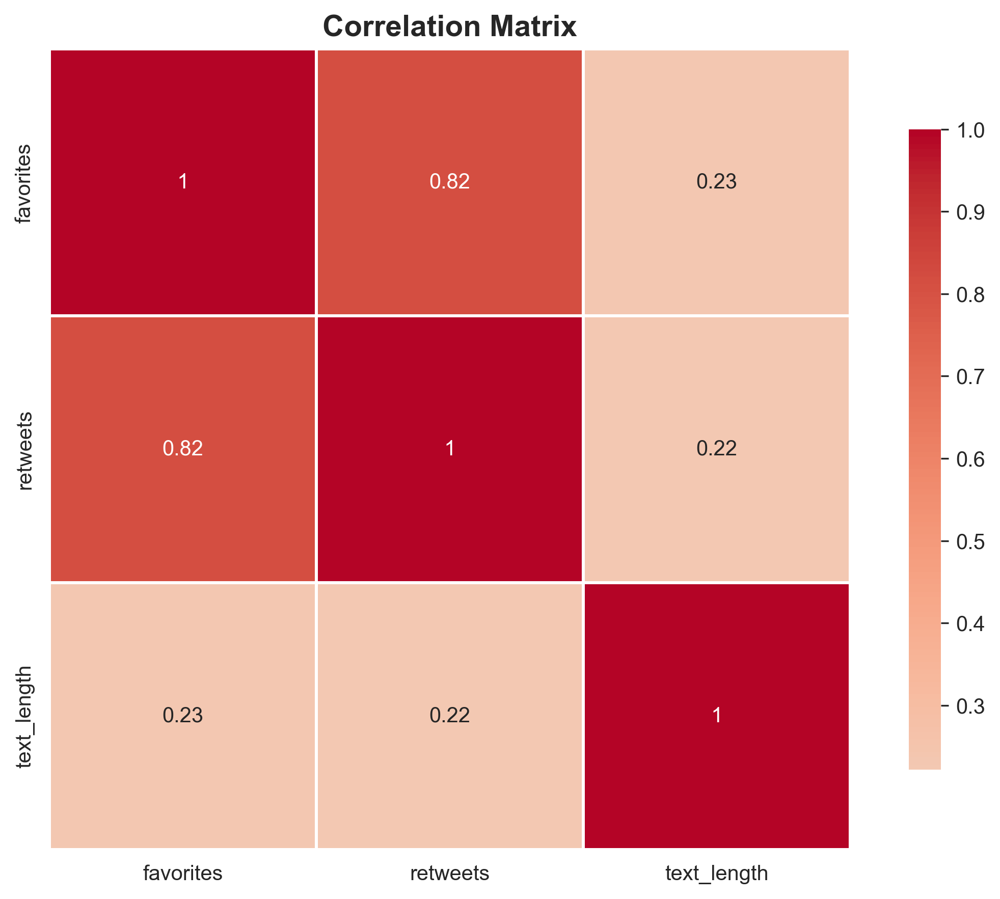

Strong positive correlation (0.89) between favorites and retweets, indicating that popular tweets tend to perform well
across both metrics. Text length shows weak correlation with engagement, suggesting content quality matters more than
length.