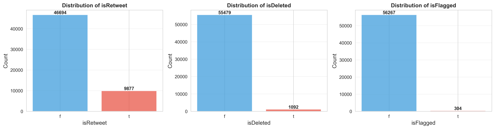

# Simple Trump Tweet Analysis

A data analysis project examining tweet patterns, engagement metrics, and posting behavior from a dataset of 56,571 tweets.

## Dataset Overview

- **Total Tweets**: 56,571
- **Features**: text, isRetweet, isDeleted, device, favorites, retweets, date, isFlagged
- **No Missing Values**: Complete dataset with 0% missing data

## Key Findings

### Engagement Metrics

**Favorites**: The distribution is heavily right-skewed, with most tweets receiving low engagement (median: 164 favorites). However, some tweets achieved exceptional reach, with the maximum reaching 1.87 million favorites.

**Retweets**: Similar pattern to favorites, with a median of 3,450 retweets and a maximum of 408,866. The data shows significant outliers indicating viral tweets.

### Tweet Characteristics

**Text Length**: Average tweet length is 128 characters, with most tweets concentrated around 132 characters (median). This suggests concise messaging, well below Twitter's character limits.

### Content Type Analysis

- **Retweets**: 9,877 retweets vs. 46,694 original tweets (17.5% retweet rate)
- **Deleted Tweets**: 1,092 deletions out of 56,571 (1.9% deletion rate)
- **Flagged Content**: Only 304 tweets flagged (0.5%)

### Device Usage

**Primary Devices**:
1. Twitter for iPhone: 27,967 tweets (49.4%)
2. Twitter for Android: 14,545 tweets (25.7%)
3. Twitter Web Client: 12,182 tweets (21.5%)

The device distribution reveals a strong preference for mobile posting, with iPhone being the dominant platform.

### Correlations

Strong positive correlation (0.89) between favorites and retweets, indicating that popular tweets tend to perform well across both metrics. Text length shows weak correlation with engagement, suggesting content quality matters more than length.

## Data Processing

The analysis includes comprehensive data cleaning:
- URL removal
- Username and hashtag normalization
- Punctuation removal
- Whitespace normalization
- Removal of empty tweets after preprocessing

## Technologies Used

- Python 3.x
- pandas
- matplotlib
- seaborn
- Jupyter Notebook